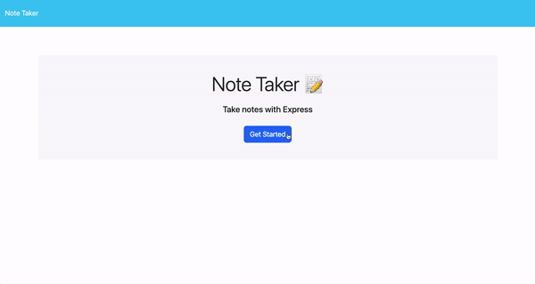

# 11 Express.js: Note Taker

## User Story

```
AS A small business owner
I WANT to be able to write and save notes
SO THAT I can organize my thoughts and keep track of tasks I need to complete
```

## Acceptance Criteria

```
GIVEN a note-taking application
WHEN I open the Note Taker
THEN I am presented with a landing page with a link to a notes page
WHEN I click on the link to the notes page
THEN I am presented with a page with existing notes listed in the left-hand column, plus empty fields to enter a new note title and the note’s text in the right-hand column
WHEN I enter a new note title and the note’s text
THEN a Save icon appears in the navigation at the top of the page
WHEN I click on the Save icon
THEN the new note I have entered is saved and appears in the left-hand column with the other existing notes
WHEN I click on an existing note in the list in the left-hand column
THEN that note appears in the right-hand column
WHEN I click on the Write icon in the navigation at the top of the page
THEN I am presented with empty fields to enter a new note title and the note’s text in the right-hand column
```

## Mock-Up

The following animation shows the web application's appearance and functionality:



## Description

This application allows users to write, save, and delete notes, utilizing Express and Node.js. From the home page, click "Get Started" and users will be redirected to the notes page. On this page, users can type in their note and hit the Save button in the upper right-hand corner, and it will appear in the left-land column. Users can also click on any saved note in that column to view them. Users can delete notes by clicking the Delete button next to the corresponding note.

## Deployment

- The URL of the functional, deployed application: https://mighty-savannah-37243-b5fb2f4e2519.herokuapp.com/

- The URL of the GitHub repository, with a unique name and a README describing the project: https://github.com/kirstynrowen/express-note-taker
